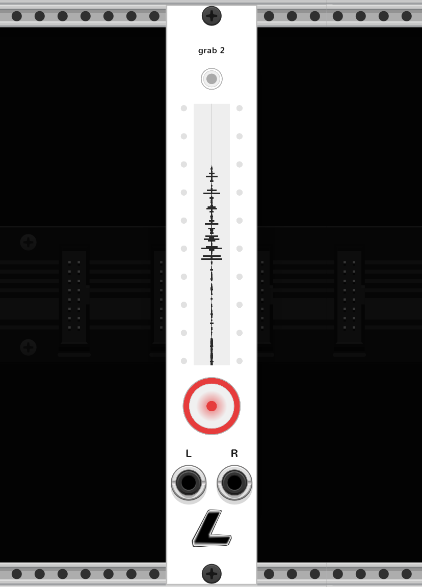
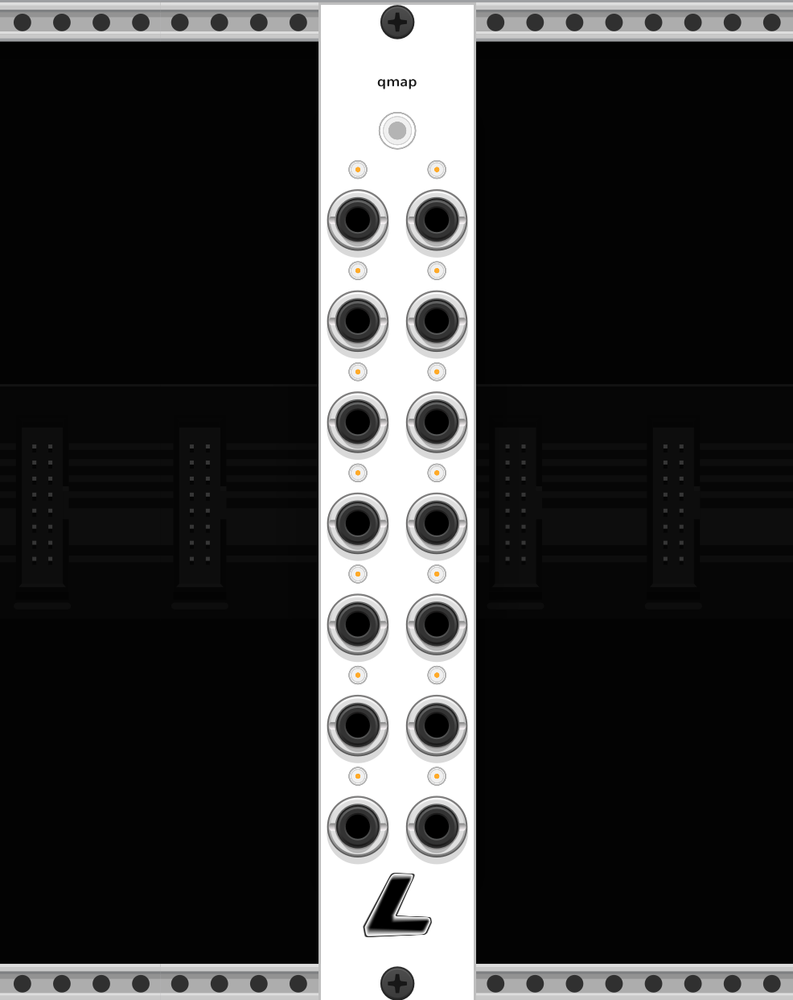
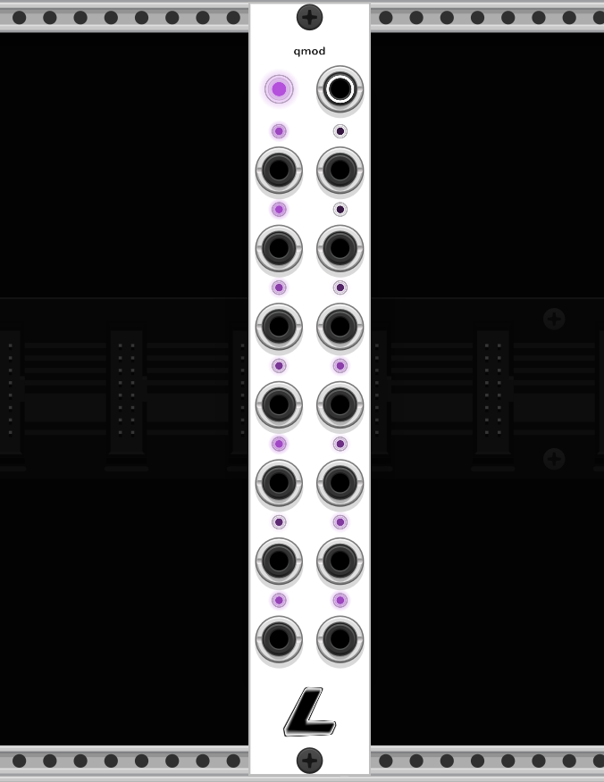

# qol — by Lux Cache

Quality-of-life modules for VCV Rack 2. Minimal panels, thoughtful defaults, and workflow tools that live outside the signal path.

## Modules

### grab 2



One recorder, every mode. Builds on `grab` (auto-triggered one-shot) and `take` (rolling retrospective buffer), stitches them into a single 4 HP panel, and adds a few tricks neither has alone. Both DSP paths run off one shared stereo input pair.

**Mode cycle** — the top LED cycles three modes. Click acts on a 2-second delay, softly flashing the pending colour, so an accidental click can't trip a one-shot mid-jam; cycle further during the countdown or wait for the commit.

- **off** — no automation; you drive recording manually
- **grab** (yellow) — auto-triggered one-shot. Opens a take on signal, closes on silence
- **snip** (pink) — silence-gated rolling buffer. When audio stops, the ring freezes (the waveform literally stops scrolling) and resumes on the next non-silent sample. Saves come out with quiet stretches elided, no editor required

**Rec button** — big dual-action centre button.
- Short click → toggles a manual force-record. Light turns red while recording (whether manual or mode-triggered)
- Long click (≥ 450 ms) → saves a take from the rolling buffer. Amber flash on fire, plus a hold-progress amber ramp so you know when it's about to trigger
- Outer ring goes red in sync with the LED core

**Peak meters + waveform** — L peak column on the left, take's vertical voice-memos waveform in the middle, R peak column on the right. A mono source lights both peak columns (signal mirrors into both sides) so it's visually clear you can record with just one cable patched.

**Other conveniences**
- **Save to sub folder** — one-click toggle that routes saves into `<outputDir>/<patch>_<dd>_<mm>_<yyyy>/`. Flipped off-on later gets a fresh date
- Separate filename prefixes for grab (`grab_NN.wav`) and take (`take_NN.wav`), shared output dir
- Mono recording: if only L (or only R) is patched, the file is written as a true mono WAV — not a stereo WAV with duplicate channels
- All of grab + take + snip settings (threshold, hangover, pre-roll, fade in/out, bit depth, normalise, buffer length, silence threshold…) available in the right-click menu

4 HP. Both standalone `grab` and `take` modules remain available — `grab 2` is the unified flagship.

### journal


Resizable text canvas with a real rich-text editor underneath. Document model follows ProseMirror's bones: blocks have a type (paragraph / heading / bullet / ordered / HR), formatting is metadata on bytes, and list markers are structural — they're rendered from block type + depth, never stored inside the text.

- Theme-aware canvas (light / dark / grey), shared across all Lux Cache modules
- Drag the bottom-right corner to resize (3–128 HP)
- Centred title field between the top screws
- Cmd+B / Cmd+I / Cmd+E for bold / italic / inline code — with **pending-mark** semantics (no selection = next character picks up the style, no markers to trip over)
- Cmd+Shift+] / [ cycles heading level (paragraph ↔ H3 … H1)
- Type `# ` at line start for a heading; `- `, `* `, `+ `, `→ `, `— `, `– ` for a bullet; `1. ` for ordered; `---` alone for a horizontal rule
- Bullet markers **preserve whatever character you typed** — lists can mix `-`, `*`, `+`, `→`, `—`, `–` freely, and each item remembers its own
- New lists auto-indent one level for visual breathing room; Shift+Tab to bring flush with the margin, Shift+Tab again to exit the list
- Enter on a non-empty list item continues at the same depth; Enter on an empty item outdents one level, and at depth 0 exits the list
- Ordered list numbers auto-derive from position — delete / reorder items and the numbering updates itself
- Tab / Shift+Tab indent and outdent inside a list; in a paragraph Tab inserts a literal tab, Shift+Tab falls through to Rack's focus-prev
- Visual-line arrow nav, word-level Alt+arrows, line Home/End, doc Cmd+↑/↓
- Cmd+A / C / X / V clipboard, Cmd+Z / Cmd+Shift+Z undo/redo with typing coalescing
- Click / shift-click / drag to select. Double-click selects a word, triple-click a block; dragging after either snaps the selection to word / block boundaries (Google Docs feel)
- Right-click menu: export as `.md` or `.txt`, insert horizontal rule, hide logo, theme picker
- Round-trips cleanly through markdown on save/load

### tidy


Selectively hide or fade individual modules and cables without touching global cable opacity.

- Picker mode — click any module in the rack to hide it or darken its panel
- Per-rule controls: cable opacity, module brightness, hide-connected-cables
- Per-cable-colour opacity so you can fade entire colour classes
- Preset slots that capture the current rule set
- Dark-mode overlay for "force this module to look dark"

### grab


Auto-triggered one-shot recorder. Listens for signal, captures the take, writes WAV. No arming cables, no gate inputs — it just records when audio's coming in.

- Stereo L/R inputs; captures mono if only one is connected
- Arm button on panel; records only when armed
- Threshold + hangover + pre-roll so attacks aren't clipped and small gaps don't end a take
- Min-take filter suppresses spurious click-triggered micro-files
- Right-click menu: threshold (dB), hangover (ms), pre-roll (ms), fade in/out (ms), max take length (s), normalise to 0 dB, bit depth (16 / 24 / 32-bit float), filename prefix, output directory, reveal folder
- Filenames auto-increment: `<prefix><NN>.wav`
- Written asynchronously on a background thread so the audio thread never touches disk

### take


Session-aware retrospective recorder. Pairs with `grab` as its opposite — `grab` starts recording when audio arrives; `take` is always quietly rolling a ring buffer of the last N seconds, so you can capture something *after* the fact. Solves the "that thing I played 30 seconds ago was perfect" problem.

- Stereo continuous ring buffer, 60 s default (adjustable 10–300 s in right-click)
- One panel button — click to freeze the last N seconds to WAV
- Voice-memos style vertical waveform on the panel: newest audio at the top, scrolls down, centred silhouette of the stereo peak
- Auto-named `<prefix><NN>.wav` files, asynchronous writer thread so the audio path never touches disk
- Right-click: buffer length, fade in/out, normalise to 0 dB, bit depth (16 / 24 / 32-bit float), filename prefix, output directory + picker, reveal folder
- 4 HP

## The Q-family

**qmap**, **qmod+** and **qmod** are three siblings designed to work together. Place any of them edge-to-edge and they recognise each other as a single **Q-array**: shared row numbering, arrayed modulation routing, and cross-module knob propagation. Or use any one standalone — they're also useful in isolation.

- Every Q module has **14 slots** arranged in 7 rows × 2 columns.
- Within an array, slots are numbered per-family: every qmap is numbered 1–14, the next qmap 15–28, etc; the qmod-family counts independently on the same rule. A qmap slot and a qmod-family slot sharing the same number are **paired** — qmod-family slot N's output feeds qmap slot N's input automatically.
- Right-click any Q module → **Join array with neighbouring LC Q modules** toggles membership. Opt a module out and it becomes a singleton; the array splits at its boundary.
- Slot LEDs carry small dynamic number labels that update live as you shuffle modules around.
- Centre-dot on a jack = the slot is actively paired with a counterpart across the array.

### qmap



14 aux CV inputs that touch-map to any parameter in the rack — uMap-style. Arm a slot, click a knob anywhere in the patch, and that knob follows the CV on the matching jack.

- Touch-to-assign uses Rack's own touched-param mechanism. Once a slot is armed, the next param you click on another module becomes its target — no dragging cables to phantom inputs. Q-family modules are deliberately excluded so you can't accidentally bind to a qmod rate knob.
- **Master button** at the top — left-click starts or advances the sequential-arm sweep (slots 1 → 14 in order, cancels mid-sweep on another click). Right-click for a direct menu: **Arm all (sequential)**, **Clear all mappings**, **Copy mappings**, **Paste mappings**.
- Per-slot arm buttons flash amber while armed. When bound, the LED tracks incoming CV and breathes with it. When *unbound* but receiving signal from an array qmod, the LED shows white (so an unmapped slot still registers what's arriving). Right-click an arm button to clear its mapping.
- Per-jack right-click → **Range** submenu (unipolar / bipolar, 10 V / 5 V / 1 V), plus **Attenuator** (±2×) and **Offset** (±10 V) sliders for inline CV conditioning.
- Array feed: each qmap slot pairs with whichever qmod-family slot has the same global index. Missing pair → no feed. A real cable always overrides the auto-feed.
- Mapping bindings persist across patch save/load via VCV's `ParamHandle` system, so reordering or duplicating target modules doesn't silently break the map. Touch-assign, clear and paste actions all go through the undo stack.

4 HP. 7 rows × 2 columns of jacks, arm buttons tucked above each with a small slot-number label on the left.

### qmod+



4 HP 14-slot modulation source. Six modes per column, each with its own LED colour that breathes with the slot's output CV.

**Modes** (per column, cycled by top button or right-click picker):

- **Random triggers** (red) — stochastic trigger bursts, ±50% jitter
- **Triggered S+H** (orange) — held value, resampled only on a trigger
- **Smooth random** (cyan, default) — smootherstep-slewed random-target wander
- **Sample & hold** (purple) — free-running S+H at each slot's rate
- **LFO** (green) — sine / triangle / square / saw (menu picker)
- **Random gates** (gold) — stochastic on/off gate pattern

Click the **column mode button** to cycle, **right-click** for a direct mode picker. Per-slot LEDs can be clicked to diverge from the column's mode; column cycle broadcasts back to every slot.

**Per-jack right-click** — **Range** submenu, **Attenuator**, **Offset**, **Slew** and **Slew shape** sliders. Slew turns any slew-capable slot into an asymmetric slew limiter:

- shape −1 → instant rise, long fall (classic drum envelope on rand-trig)
- shape  0 → symmetric
- shape +1 → long rise, instant fall

Random triggers and random gates pass through the slew too — set shape −1 on a rand-trig slot to generate AR envelopes on every pulse.

**Module right-click** — LFO waveshape, global rate, global smoothness, stagger toggle + spread, range (all slots), in-array toggle, copy/paste settings (shared with qmod).

### qmod

Same 14-slot mod source as qmod+, but in **6 HP** with a per-row **log-scaled rate knob strip** on the right, a **trigger / CV input** jack, and **Apply stagger** menu actions.

- Left 4 HP mirrors qmod+'s layout exactly — same column centres, same pitch — so modules line up row-for-row in an array.
- **Rate knob strip** on the right: one knob per row, ±2 decades (0.01× … 100×) around the base rate, log-scaled. When a qmod is in a Q-array, its row knobs drive every qmod / qmod+ in the array — leftmost qmod wins so you can stack "coarse" and "fine" controls.
- **Apply stagger** menu action writes a log-spread directly into the row knobs (row 0 = 1×, row 6 = spreadRatio×). **Reset row knobs to 1×** flattens.
- **Trigger / CV input** (right-click the jack for the mode picker): Trigger / resync, Gate (run/freeze), CV → rate / smoothness / mode. A rising edge on this jack resyncs *every* qmod / qmod+ in the array, so rand-trig / rand-gate / triggered-S+H all fire in lockstep.
- Everything else inherits from qmod+: per-column modes, LFO shape, slew + shape per jack, range, atten, offset, copy/paste (shared clipboard), undo.

### flow

Routing switcher for a four-effect send/return loop. Wire up to four external effects to the four send/return pairs; `flow` reorders the chain on the fly between eight factory permutations.

- **4 slots × send/return** — greyscale row tints and A/B/C/D labels between each pair's jacks identify slot-to-letter mapping. Unplugged returns bypass their slot so incomplete chains still pass audio.
- **Chain IN / OUT** at the bottom of the row stack. Polyphonic cables pass through untouched — stereo "just works" when the source feeds 2 channels down one cable.
- **Master cycle button + order chip strip** at the top: click to advance preset, chips cross-dissolve to the new A/B/C/D processing order.
- **CV order input** — 0..10 V picks one of the 8 presets, quantised with 15% hysteresis on zone boundaries.
- **8 factory permutations** — straight, full reverse, pair swap, inner swap, outer/inner reverse, pair rotation, rotate left, rotate right. Cycle button, CV, or right-click radio list.
- **Fade / Morph transition** — right-click picker. Fade is a 20 ms duck that just hides the routing jump; Morph stretches to a 400 ms audible crossfade where the chip display and audio dissolve into the new permutation together.
- **Bypass** — bottom-centre gate input above a sticky toggle button. Button latches chain IN → OUT; gate forces bypass while high (stutter-style when tapped). Sends stay active during bypass so effects keep their state warm for re-entry.
- **Copy / Paste preset** between flow modules. Every preset change, bypass toggle, and paste goes through the undo stack.
- Each chain hop costs 1 sample of latency (≈0.09 ms total at 44.1 kHz) because Rack can't topologically order cable loops; inaudible in practice.

4 HP. Persists preset, bypass state, and fade mode in JSON.

### capture


Two exports off one panel: **capture** takes a PNG of the rack, **scan** writes a markdown dependency inventory of the current patch. Fills two long-standing community gaps — the only built-in PNG path was a CLI-only `--screenshot` flag, and Rack buries plugin dependencies in the patch JSON as slugs only.

**capture** — one-click PNG of what's on screen

- Amber flash on successful save
- **Fit whole rack** by default — zooms out to frame every module before the shot, so you don't have to pre-navigate
- Brief settle delay so module panels redraw at the new zoom before capture (no stale cached renders)
- Hides its own module during the shot so the capture button isn't in the frame
- High-DPI native — retina framebuffer → retina PNG
- Files: `<prefix><NN>.png`, auto-indexed

**scan** — markdown dependency report for the current patch

- Walks every module, groups by plugin, writes `plugin name + version + per-module count`
- Install list with direct links to each plugin's page on library.vcvrack.com so recipients can go straight to the subscribe button
- Optionally copies the report to the clipboard on press (on by default) — "copied" confirmation fades in under the button
- Files: `<prefix><NN>.md`, auto-indexed, shares the output directory with capture

Right-click covers both sides: fit-all / hide-self / viewport-only toggles for capture, run-now and clipboard-copy for scan, separate filename prefixes, shared output directory + picker + reveal, dark mode.

3 HP.

## Building

Requires the VCV Rack SDK. Set `RACK_DIR` to point at it:

```
make
make install        # copies into your local VCV plugins folder
```

## License

Proprietary — © Lux Cache.
