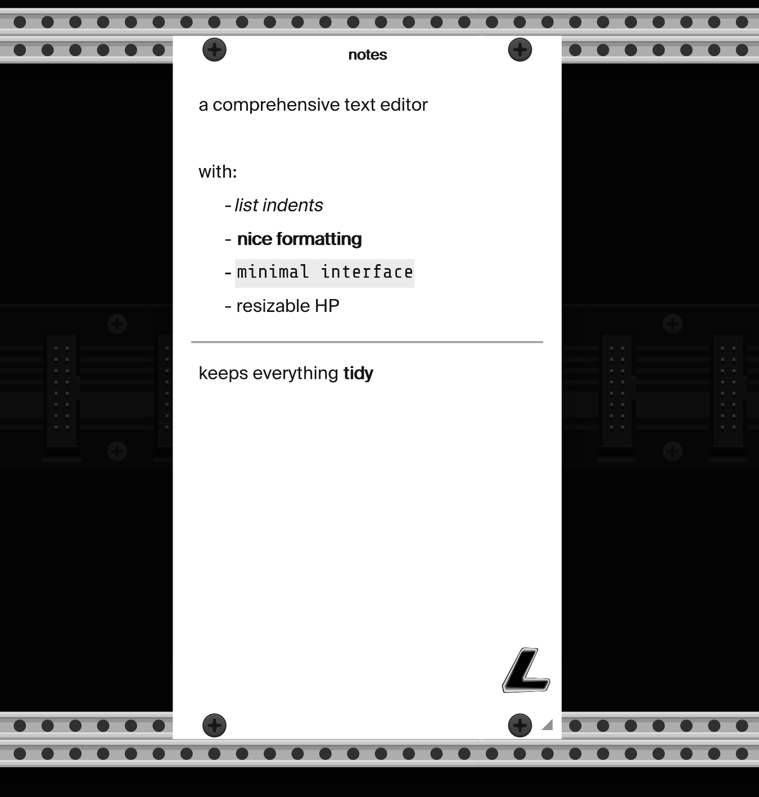

# Lux Cache — VCV Rack modules

A collection of utility and visual modules for VCV Rack 2.

## Modules

### Notes



A resizable notes canvas with smart text editing.

- Pure black / pure white canvas, dark-mode toggle
- Drag the bottom-right corner to resize (3–128 HP)
- Centered title field between the top screws
- Full-featured text editor: visual-line nav, word-level nav, undo/redo, double/triple-click to select word / paragraph
- Inline formatting: `**bold**`, `_italic_` or `*italic*`, `` `code` `` — markers hidden while you edit (`Cmd+B`, `Cmd+I`, `Cmd+E`)
- Headings (`# … ######`) rendered larger and bolder (`Cmd+Shift+]` / `Cmd+Shift+[`)
- Auto-continuing lists: `-`, `*`, `+`, `•`, `→`, `—`, `▪`, `·`, plus numbered
- Tab / Shift+Tab to nest / outdent
- Double-Enter on an empty bullet exits the list
- Horizontal rule (`---`) rendered as a full-width line; also "Insert horizontal line" in the right-click menu
- Smart Enter: pressing Enter inside a bold/italic/code span continues the formatting on the next line
- Right-click menu: raw-mode toggle to reveal markers, export as `.md` / `.txt`, hide logo, dark mode
- Scroll wheel when content overflows
- Caret blinks to macOS-standard timing

### Tidy


Selectively hide or fade individual modules and cables without changing global cable opacity.

- Picker mode to click modules in the rack to hide / darken them
- Per-rule cable opacity, hide-connected-cables, module brightness
- Preset slots
- Dark-mode overlay

## Building

Requires the VCV Rack SDK. Set `RACK_DIR` to point at it:

```
make
make install        # copies into your local VCV plugins folder
```

## License

Proprietary — © Lux Cache.
