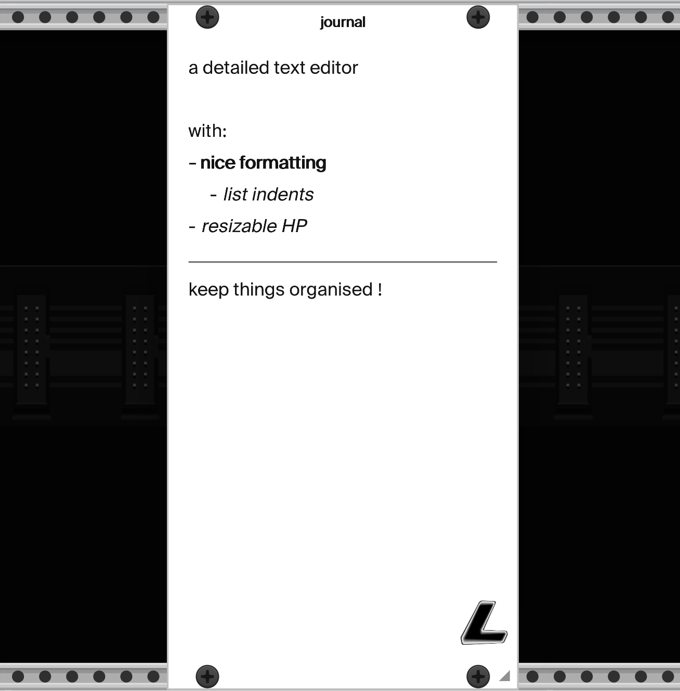
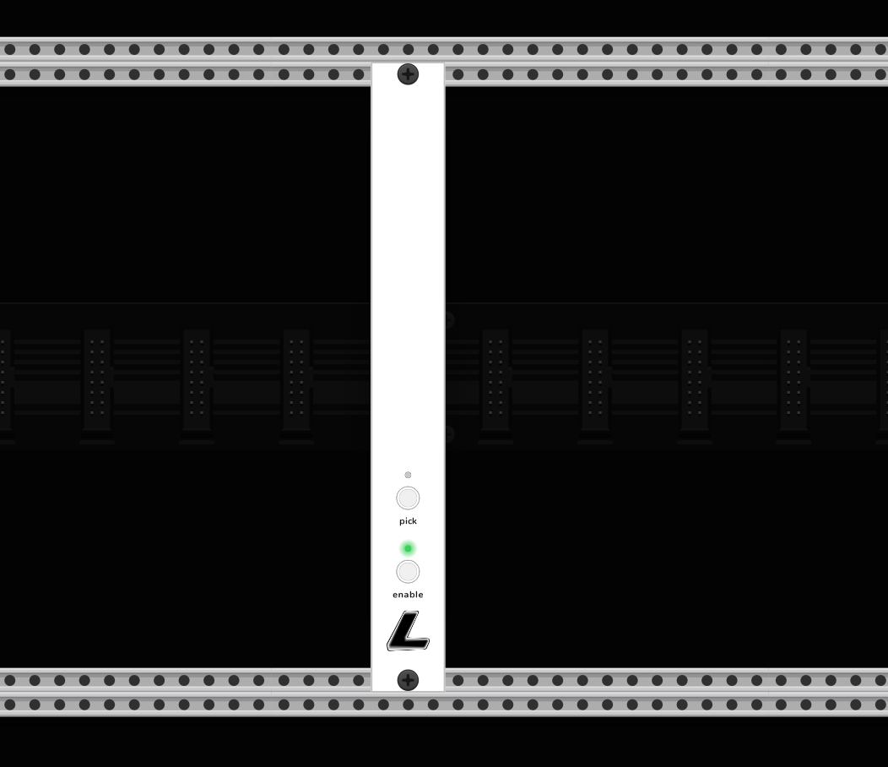
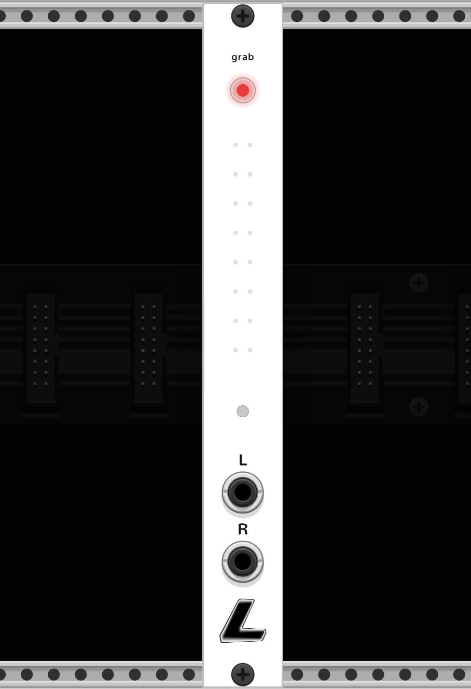
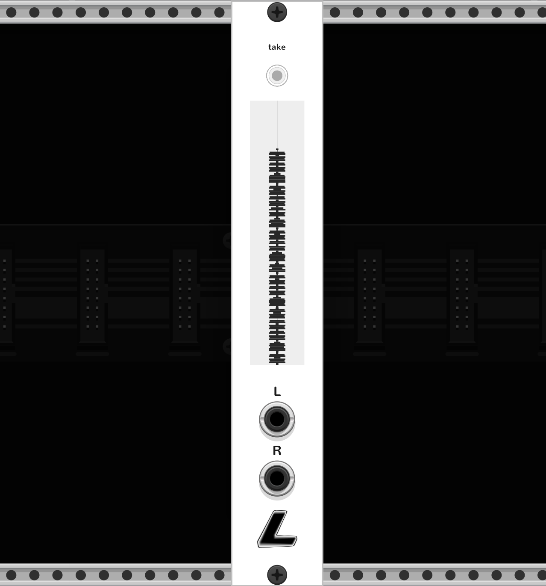
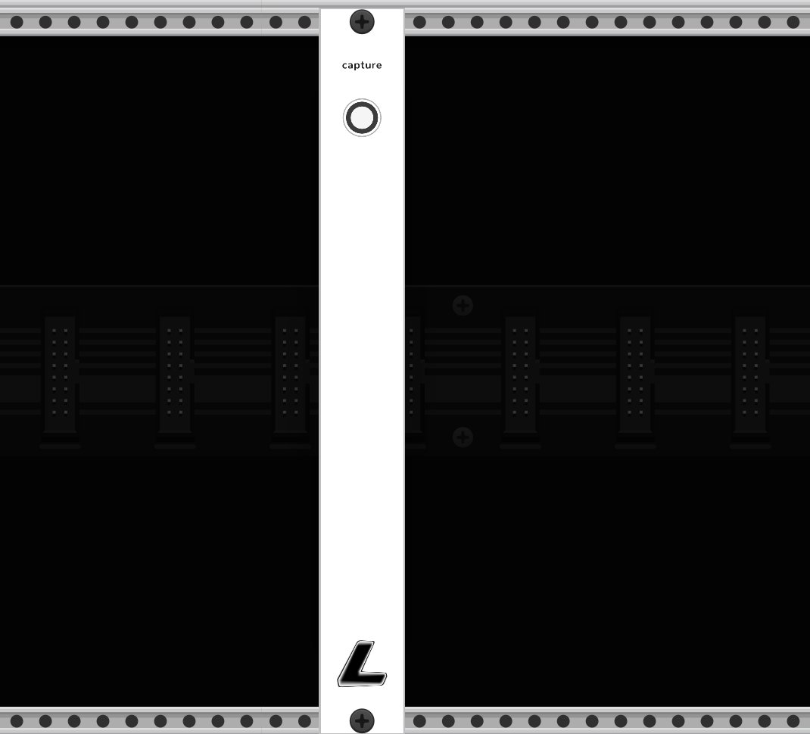
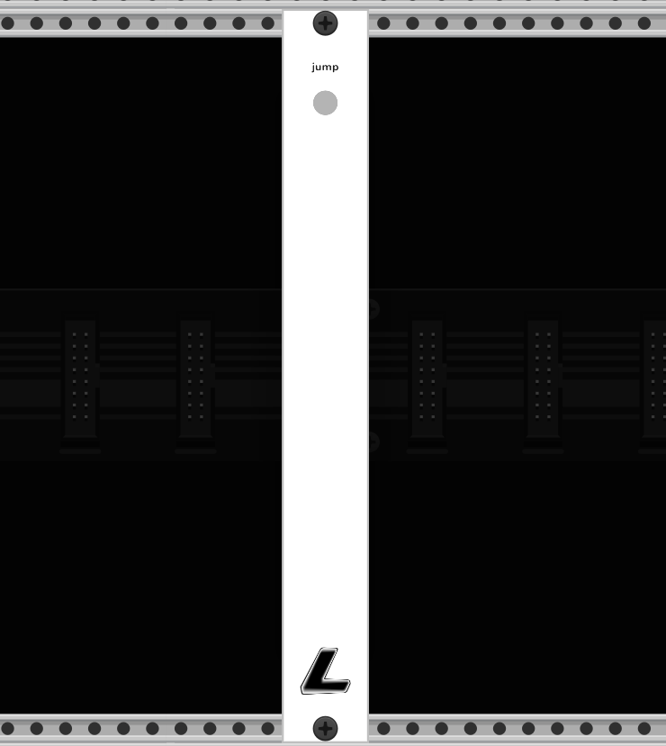

# qol — by Lux Cache

Quality-of-life modules for VCV Rack 2. Minimal panels, thoughtful defaults, and workflow tools that live outside the signal path.

## Modules

### journal



Resizable text canvas with a proper rich-text editor underneath. Built on a document model — formatting is metadata on bytes, not markdown markers sitting inside your text.

- Pure black / pure white canvas, shared dark-mode toggle
- Drag the bottom-right corner to resize (3–128 HP)
- Centred title field between the top screws
- Cmd+B / Cmd+I / Cmd+E for bold / italic / inline code — with **pending-mark** semantics (no selection = next character picks up the style, no markers to trip over)
- Cmd+Shift+] / [ cycles heading level (paragraph ↔ H3 … H1)
- Type `# ` at line start for a heading, `- `/`* `/`+ ` for a bullet, `1. ` for ordered, `---` alone for a horizontal rule
- Enter on a list auto-continues the marker (ordered auto-increments); Enter on an empty item exits the list
- Tab / Shift+Tab indents / outdents list items
- Visual-line arrow nav, word-level Alt+arrows, line Home/End, doc Cmd+↑/↓
- Cmd+A / C / X / V clipboard, Cmd+Z / Cmd+Shift+Z undo/redo with typing coalescing
- Click / drag / double-click-word / triple-click-block selection
- Right-click menu: export as `.md` or `.txt`, insert horizontal line, hide logo, dark mode
- Round-trips cleanly through markdown on save/load

### tidy



Selectively hide or fade individual modules and cables without touching global cable opacity.

- Picker mode — click any module in the rack to hide it or darken its panel
- Per-rule controls: cable opacity, module brightness, hide-connected-cables
- Per-cable-colour opacity so you can fade entire colour classes
- Preset slots that capture the current rule set
- Dark-mode overlay for "force this module to look dark"

### grab



Auto-triggered one-shot recorder. Listens for signal, captures the take, writes WAV. No arming cables, no gate inputs — it just records when audio's coming in.

- Stereo L/R inputs; captures mono if only one is connected
- Arm button on panel; records only when armed
- Threshold + hangover + pre-roll so attacks aren't clipped and small gaps don't end a take
- Min-take filter suppresses spurious click-triggered micro-files
- Right-click menu: threshold (dB), hangover (ms), pre-roll (ms), fade in/out (ms), max take length (s), normalise to 0 dB, bit depth (16 / 24 / 32-bit float), filename prefix, output directory, reveal folder
- Filenames auto-increment: `<prefix><NN>.wav`
- Written asynchronously on a background thread so the audio thread never touches disk

### take



Session-aware retrospective recorder. Pairs with `grab` as its opposite — `grab` starts recording when audio arrives; `take` is always quietly rolling a ring buffer of the last N seconds, so you can capture something *after* the fact. Solves the "that thing I played 30 seconds ago was perfect" problem.

- Stereo continuous ring buffer, 60 s default (adjustable 10–300 s in right-click)
- One panel button — click to freeze the last N seconds to WAV
- Voice-memos style vertical waveform on the panel: newest audio at the top, scrolls down, centred silhouette of the stereo peak
- Auto-named `<prefix><NN>.wav` files, asynchronous writer thread so the audio path never touches disk
- Right-click: buffer length, fade in/out, normalise to 0 dB, bit depth (16 / 24 / 32-bit float), filename prefix, output directory + picker, reveal folder
- 4 HP

### capture



One-click PNG snapshot of the rack. Fills a long-standing community gap — the only built-in path was a CLI-only `--screenshot` flag on the Rack binary.

- Shutter-style button, camera lens aesthetic; amber flash on successful save
- **Fit whole rack** by default — zooms out to frame every module before the shot, so you don't have to pre-navigate
- Brief settle delay so module panels redraw at the new zoom before capture (no stale cached renders)
- Hides its own module during the shot so the capture button isn't in the frame
- High-DPI native — retina framebuffer → retina PNG
- Right-click: fit-all / hide-self / viewport-only toggles, filename prefix, output directory + picker + reveal, dark mode
- Files: `<prefix><NN>.png`, auto-indexed, default dir matches `grab` / `take`
- 3 HP

### jump (experimental)



Saved-view bookmarks for navigating large patches. Click the dot to arm, then `Cmd+1..9` saves the current scroll + zoom; not armed, `Cmd+1..9` jumps to that slot.

- 9 slots, per-patch persistence
- `Cmd+[` / `Cmd+]` back/forward through nav history
- Pulse-on-arrival so the eye can follow the jump
- One amber-pulse dot on the panel; `Esc` cancels arm

Filed as experimental: the view-restore has a known zoom drift on tight close-up saves (5% of viewport is baked into Rack's `zoomToBound` padding, which translates to ~5–17% zoom-out depending on how zoomed-in you were). Overview-scale bookmarks are near-perfect; re-saving from the landed view is an easy self-correct.

## Building

Requires the VCV Rack SDK. Set `RACK_DIR` to point at it:

```
make
make install        # copies into your local VCV plugins folder
```

## License

Proprietary — © Lux Cache.
